# Entity–Relationship Diagram

43 tables in MySQL 8. 42 are shown below as entities, `UserRoles` drawn as a direct many-to-many, and
`__EFMigrationsHistory` left out as EF Core's own migration bookkeeping, not part of the data model.
Verified column-for-column against `SHOW TABLES` / `DESCRIBE` on the live database.

This file does not update itself. Bring it back in step after a schema change, since it has fallen behind
before, which is worse than having no diagram at all, because a wrong one is still believed.

## Legend

- 🟦 Identity & academic structure: users, roles, departments, profiles
- 🟩 Container core: the hub every pipeline hangs off
- 🟧 Pipeline 1 · Research proposals
- 🟪 Pipeline 2 · Ethics approval
- 🟨 Pipeline 3 · Research paper & committee
- 🟫 Cross-cutting: notifications, audit, config

## Diagram

```mermaid
erDiagram
    Users {
        char36 Id PK
        varchar Email UK
        varchar FirstName
        varchar LastName
        varchar Status
        varchar AuthProvider
    }
    Roles {
        char36 Id PK
        varchar Name UK
    }
    UserClaims {
        int Id PK
        char36 UserId FK
        text ClaimType
        text ClaimValue
    }
    UserLogins {
        varchar LoginProvider PK
        varchar ProviderKey PK
        text ProviderDisplayName
        char36 UserId FK
    }
    UserTokens {
        char36 UserId PK
        varchar LoginProvider PK
        varchar Name PK
        text Value
    }
    RoleClaims {
        int Id PK
        char36 RoleId FK
        text ClaimType
        text ClaimValue
    }
    Departments {
        char36 Id PK
        varchar Name
        varchar Code UK
    }
    StudentProfiles {
        char36 Id PK
        char36 UserId FK
        char36 DepartmentId FK
        varchar StudentIdNumber UK
        varchar Programme
        varchar Cohort
        char36 PreferredSupervisorId FK
    }
    SupervisorProfiles {
        char36 Id PK
        char36 UserId FK
        char36 DepartmentId FK
        text AreasOfExpertise
    }
    CoordinatorProfiles {
        char36 Id PK
        char36 UserId FK
        char36 DepartmentId FK
        tinyint1 IsAvailableForAssignment
    }
    HeadOfDepartmentProfiles {
        char36 Id PK
        char36 UserId FK
        char36 DepartmentId FK
    }
    CommitteeMemberProfiles {
        char36 Id PK
        char36 UserId FK
        varchar Type
    }
    ResearchAreas {
        char36 Id PK
        varchar Name UK
    }
    StudentResearchAreas {
        char36 ResearchAreasId PK
        char36 StudentsId PK
    }
    Keywords {
        char36 Id PK
        varchar Name UK
    }
    RefreshTokens {
        char36 Id PK
        char36 UserId FK
        varchar Token UK
        datetime6 ExpiresAt
    }
    PublicationContainers {
        char36 Id PK
        char36 StudentId FK
        char36 CoordinatorId FK
        char36 AssignedSupervisorId FK
        varchar CurrentPipeline
        varchar Status
    }
    ActivityHistoryEntries {
        char36 Id PK
        char36 PublicationContainerId FK
        char36 ActorUserId FK
        char36 OnBehalfOfUserId FK
        varchar Action
        text Comments
    }
    ResearchProposals {
        char36 Id PK
        char36 PublicationContainerId FK
        varchar Title
        varchar Status
        datetime6 SubmittedAt
    }
    ProposalSupervisorSelections {
        char36 Id PK
        char36 ProposalId FK
        char36 SupervisorId FK
        tinyint1 IsSelected
    }
    ProposalAssignments {
        char36 Id PK
        char36 ProposalId FK
        char36 SupervisorId FK
        char36 CoordinatorId FK
    }
    EthicsDeclarations {
        char36 Id PK
        char36 PublicationContainerId FK
        varchar StudentResponse
    }
    EthicsApprovals {
        char36 Id PK
        char36 PublicationContainerId FK
        varchar Status
        varchar ReferenceNumber
    }
    EthicsDocuments {
        char36 Id PK
        char36 EthicsApprovalId FK
        char36 EthicsDocumentRequirementId FK
        char36 UploadedByUserId FK
        int Version
        varchar Status
    }

    UserInvitations {
        char36 Id PK
        varchar Email
        varchar Role
        char36 DepartmentId FK
        varchar TokenHash UK
        datetime ExpiresAt
        char36 InvitedByUserId FK
        datetime AcceptedAt
        datetime RevokedAt
    }

    EthicsDocumentRequirements {
        char36 Id PK
        varchar Name UK
        int SortOrder
        bool IsActive
    }

    EthicsApprovalRequirements {
        char36 Id PK
        char36 EthicsApprovalId FK
        char36 EthicsDocumentRequirementId FK
        int SortOrder
    }
    Publications {
        char36 Id PK
        char36 PublicationContainerId FK
        char36 PublishedByUserId FK
        varchar Title
        varchar Status
        tinyint1 IsPublished
    }
    PublicationKeywords {
        char36 KeywordsId PK
        char36 PublicationsId PK
    }
    PublicationResearchAreas {
        char36 PublicationsId PK
        char36 ResearchAreasId PK
    }
    PublicationVersions {
        char36 Id PK
        char36 PublicationId FK
        char36 UploadedByUserId FK
        int VersionNumber
    }
    Reviews {
        char36 Id PK
        char36 PublicationVersionId FK
        char36 ReviewerUserId FK
        varchar ReviewerType
        varchar Decision
    }
    Committees {
        char36 Id PK
        char36 PublicationId FK
        char36 CreatedByUserId FK
        varchar Status
        int MinApprovalsRequired
    }
    CommitteeRoleConfigs {
        char36 Id PK
        char36 CommitteeId FK
        varchar RoleType
        int RequiredCount
    }
    CommitteeMembers {
        char36 Id PK
        char36 CommitteeId FK
        char36 UserId FK
        varchar RoleType
        varchar Decision
    }
    Notifications {
        char36 Id PK
        char36 UserId FK
        varchar Type
        tinyint1 IsRead
    }
    AuditLogEntries {
        char36 Id PK
        char36 ActorUserId FK
        char36 OnBehalfOfUserId FK
        varchar ActionType
        varchar EntityType
    }
    SystemSettings {
        char36 Id PK
        varchar Key UK
        text Value
        char36 UpdatedByUserId FK
    }
    SupervisorGroups {
        char36 Id PK
        char36 OwnerId FK
        varchar Name
        datetime CreatedAt
        datetime UpdatedAt
    }
    SupervisorGroupMembers {
        char36 SupervisorGroupId PK
        char36 SupervisorId PK
    }
    DepartmentMemberships {
        char36 Id PK
        char36 UserId FK
        char36 DepartmentId FK
        datetime CreatedAt
    }
    StoredFileContents {
        char36 Id PK
        varchar SubFolder
        varchar FileName
        longblob Content
        bigint Length
        datetime CreatedAt
    }

    Users }o--o{ Roles : "UserRoles"
    Users ||--o{ SupervisorGroups : "owns"
    SupervisorGroups ||--o{ SupervisorGroupMembers : ""
    Users ||--o{ SupervisorGroupMembers : ""
    Users ||--o{ DepartmentMemberships : ""
    Departments ||--o{ DepartmentMemberships : ""
    Users ||--o{ UserClaims : ""
    Users ||--o{ UserLogins : ""
    Users ||--o{ UserTokens : ""
    Roles ||--o{ RoleClaims : ""
    Departments ||--o{ StudentProfiles : ""
    Departments ||--o{ SupervisorProfiles : ""
    Departments ||--o{ CoordinatorProfiles : ""
    Departments ||--o| HeadOfDepartmentProfiles : ""
    Users ||--o| StudentProfiles : ""
    Users ||--o| SupervisorProfiles : ""
    Users ||--o| CoordinatorProfiles : ""
    Users ||--o| HeadOfDepartmentProfiles : ""
    Users ||--o| CommitteeMemberProfiles : ""
    Users o|..o{ StudentProfiles : "preferred supervisor"
    ResearchAreas ||--o{ StudentResearchAreas : ""
    StudentProfiles ||--o{ StudentResearchAreas : ""
    Users ||--o{ RefreshTokens : ""
    Users ||--o{ PublicationContainers : "as student"
    Users ||--o{ PublicationContainers : "as coordinator"
    Users o|..o{ PublicationContainers : "as supervisor"
    PublicationContainers ||--o{ ActivityHistoryEntries : ""
    Users ||--o{ ActivityHistoryEntries : "actor"
    Users o|..o{ ActivityHistoryEntries : "on behalf of"
    PublicationContainers ||--o{ ResearchProposals : ""
    ResearchProposals ||--o{ ProposalSupervisorSelections : ""
    Users ||--o{ ProposalSupervisorSelections : "supervisor"
    ResearchProposals ||--o| ProposalAssignments : ""
    Users ||--o{ ProposalAssignments : "supervisor"
    Users ||--o{ ProposalAssignments : "coordinator"
    PublicationContainers ||--o| EthicsDeclarations : ""
    PublicationContainers ||--o| EthicsApprovals : ""
    EthicsApprovals ||--o{ EthicsDocuments : ""
    EthicsApprovals ||--o{ EthicsApprovalRequirements : ""
    EthicsDocumentRequirements ||--o{ EthicsApprovalRequirements : ""
    EthicsDocumentRequirements ||--o{ EthicsDocuments : ""
    Users ||--o{ UserInvitations : "invited by"
    Departments |o--o{ UserInvitations : ""
    Users ||--o{ EthicsDocuments : "uploaded by"
    PublicationContainers ||--o| Publications : ""
    Users o|..o{ Publications : "published by"
    Keywords ||--o{ PublicationKeywords : ""
    Publications ||--o{ PublicationKeywords : ""
    Publications ||--o{ PublicationResearchAreas : ""
    ResearchAreas ||--o{ PublicationResearchAreas : ""
    Publications ||--o{ PublicationVersions : ""
    Users ||--o{ PublicationVersions : "uploaded by"
    PublicationVersions ||--o{ Reviews : ""
    Users ||--o{ Reviews : "reviewer"
    Publications ||--o| Committees : ""
    Users ||--o{ Committees : "created by"
    Committees ||--o{ CommitteeRoleConfigs : ""
    Committees ||--o{ CommitteeMembers : ""
    Users ||--o{ CommitteeMembers : ""
    Users ||--o{ Notifications : ""
    Users ||--o{ AuditLogEntries : "actor"
    Users o|..o{ AuditLogEntries : "on behalf of"
    Users o|..o{ SystemSettings : "updated by"
```

Solid lines = required foreign key · dashed lines = nullable/optional foreign key · `||` on both ends of a
line = the foreign key also carries a unique index (one-to-one).

## Reading this diagram

- **Two tables really are left out.** `UserRoles` is drawn as a direct `Users}o--o{Roles` many-to-many
  rather than its own box (it has no columns beyond the two foreign keys). `__EFMigrationsHistory` is EF
  Core's own migration ledger, not part of the application's data.
- **`PublicationContainers.StudentId` isn't DB-unique.** The one-container-per-student rule is enforced in
  `ContainerService`, not by a database constraint, and shown here as one-to-many to reflect what the schema
  actually allows.
- **Users is a hub.** Nearly every table carries an actor, reviewer, uploader, or assignee reference back to
  `Users`. That fan-out is real, not a diagram artefact: almost every workflow action is attributable to a
  specific person.
- **PublicationContainers is the other hub.** It's the spine every pipeline hangs off: proposals, ethics, and
  the paper itself each resolve back to exactly one container per student.

## Data dictionary

### 🟦 Identity & academic structure (20 tables)

| Table | Description | Keys |
| --- | --- | --- |
| `Users` | Every account: student, staff or committee member. Extends ASP.NET Identity. | PK `Id` |
| `Roles` | The 8 fixed roles (Admin, Coordinator, Supervisor, …). | PK `Id` |
| `UserClaims` | Identity plumbing, arbitrary claims per user. Unused today, framework-managed. | PK `Id` · FK `UserId` |
| `UserLogins` | External login provider links (e.g. future Azure AD). Empty until Entra SSO is wired up. | PK `LoginProvider+ProviderKey` · FK `UserId` |
| `UserTokens` | Identity's per-purpose token store, where password reset and email confirmation tokens land. | PK `UserId+LoginProvider+Name` |
| `RoleClaims` | Claims attached to a role rather than a user. Unused today, framework-managed. | PK `Id` · FK `RoleId` |
| `Departments` | Academic departments; scopes coordinators, supervisors and the HoD. | PK `Id` · UK `Code` |
| `StudentProfiles` | Student-specific fields: programme, cohort, ORCID, preferred supervisor. | PK `Id` · FK `UserId`, `DepartmentId` |
| `SupervisorProfiles` | Expertise and research interests for supervisors. | PK `Id` · FK `UserId`, `DepartmentId` |
| `CoordinatorProfiles` | Tracks availability for the fewest-students auto-assignment rule. | PK `Id` · FK `UserId`, `DepartmentId` |
| `HeadOfDepartmentProfiles` | Exactly one per department (unique on `DepartmentId`). | PK `Id` · FK `UserId`, `DepartmentId` |
| `CommitteeMemberProfiles` | Marks a user Internal or External for committee eligibility. | PK `Id` · FK `UserId` |
| `ResearchAreas` | Shared tag set: student interests and publication topics. | PK `Id` · UK `Name` |
| `StudentResearchAreas` | Join table: which research areas a student lists on their profile. | PK `ResearchAreasId+StudentsId` |
| `Keywords` | Free-text tags attached to published papers. | PK `Id` · UK `Name` |
| `RefreshTokens` | JWT refresh tokens; rotated on use, revocable. | PK `Id` · FK `UserId` |
| `UserInvitations` | An administrator's invitation to open an account, with the role it will carry and when it expires. | PK `Id` · FK `InvitedByUserId` |
| `SupervisorGroups` | A coordinator's named set of supervisors, so a batch that goes out together is chosen once rather than reassembled each time. | PK `Id` · FK `OwnerId` |
| `SupervisorGroupMembers` | Who is in one of those sets. | PK `SupervisorGroupId+SupervisorId` |
| `DepartmentMemberships` | The departments a supervisor or reviewer belongs to, beyond the single one their profile names: both can serve more than one. | PK `Id` · FK `UserId`, `DepartmentId` |

### 🟩 Container core (2 tables)

| Table | Description | Keys |
| --- | --- | --- |
| `PublicationContainers` | The hub for one student's publication process: student, coordinator, assigned supervisor, current pipeline. | PK `Id` · FK `StudentId`, `CoordinatorId` |
| `ActivityHistoryEntries` | Mandatory-comment narrative log of every change to a container, visible to everyone with access. | PK `Id` · FK `PublicationContainerId`, `ActorUserId` |

### 🟧 Pipeline 1: Research proposals (3 tables)

| Table | Description | Keys |
| --- | --- | --- |
| `ResearchProposals` | Title + abstract; editable while Draft, locked on submission. | PK `Id` · FK `PublicationContainerId` |
| `ProposalSupervisorSelections` | One row per (proposal, invited supervisor), invited then optionally marked feasible. | PK `Id` · FK `ProposalId`, `SupervisorId` |
| `ProposalAssignments` | The coordinator's final allocation of a proposal to a supervisor. | PK `Id` · FK `ProposalId` (UK), `SupervisorId`, `CoordinatorId` |

### 🟪 Pipeline 2: Ethics approval (5 tables)

| Table | Description | Keys |
| --- | --- | --- |
| `EthicsDeclarations` | The student's Yes / No / Unsure declaration. | PK `Id` · FK `PublicationContainerId` (UK) |
| `EthicsApprovals` | Status machine: NotRequired → PendingUpload → PendingVerification → Verified. | PK `Id` · FK `PublicationContainerId` (UK) |
| `EthicsDocuments` | The documents a student supplied, versioned per re-upload. | PK `Id` · FK `EthicsApprovalId`, `EthicsDocumentRequirementId`, `UploadedByUserId` |
| `EthicsDocumentRequirements` | The documents an administrator asks for. Retired rather than deleted, since uploads reference them. | PK `Id` · UK `Name` |
| `EthicsApprovalRequirements` | The list one approval was asked for, copied when documentation was requested so a later change applies to new work only. | PK `Id` · FK `EthicsApprovalId`, `EthicsDocumentRequirementId` |

### 🟨 Pipeline 3: Research paper & committee (8 tables)

| Table | Description | Keys |
| --- | --- | --- |
| `Publications` | The paper itself: status, publish flag, category, keywords, research areas. | PK `Id` · FK `PublicationContainerId` (UK) |
| `PublicationVersions` | Every uploaded file, numbered and kept, and nothing is overwritten. | PK `Id` · FK `PublicationId`, `UploadedByUserId` |
| `Reviews` | A supervisor or committee member's decision + comments on one version. | PK `Id` · FK `PublicationVersionId`, `ReviewerUserId` |
| `Committees` | The evaluation committee assigned to one publication. | PK `Id` · FK `PublicationId` (UK) |
| `CommitteeRoleConfigs` | Required member counts per role, either the global default or a per-committee override. | PK `Id` · FK `CommitteeId` (nullable) |
| `CommitteeMembers` | Membership + individual approve/reject decision. | PK `Id` · FK `CommitteeId`, `UserId` |
| `PublicationKeywords` | Join table: which keywords are attached to a published paper. | PK `KeywordsId+PublicationsId` |
| `PublicationResearchAreas` | Join table: which research areas a publication is tagged with. | PK `PublicationsId+ResearchAreasId` |

### 🟫 Cross-cutting (4 tables)

| Table | Description | Keys |
| --- | --- | --- |
| `Notifications` | In-app inbox; every row also triggers an email via `SmtpEmailSender`. | PK `Id` · FK `UserId` |
| `AuditLogEntries` | Append-only, system-wide trail. FKs to `Users` are `RESTRICT`, so they are never orphaned by a deletion. | PK `Id` · FK `ActorUserId` |
| `SystemSettings` | Admin-editable key/value store for workflow parameters. | PK `Id` · UK `Key` |
| `StoredFileContents` | The uploaded files themselves, where the deployment keeps them in the database rather than on a disk it does not have. | PK `Id` |
